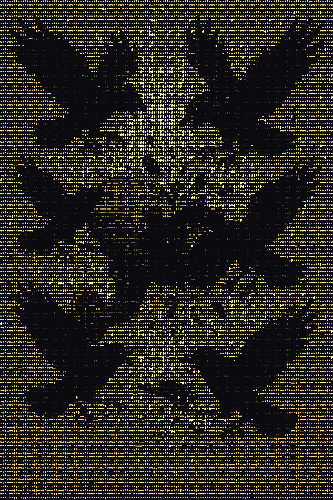

# Flock You: Flock Safety Detection System



**Professional surveillance camera detection for the Oui-Spy device available at [colonelpanic.tech](https://colonelpanic.tech)**

## Overview

Flock You is an advanced detection system designed to identify Flock Safety surveillance cameras, Raven gunshot detectors, and similar surveillance devices using multiple detection methodologies. Built for the Xiao ESP32 S3 microcontroller, it provides real-time monitoring with audio alerts and comprehensive JSON output. The system now includes specialized BLE service UUID fingerprinting for detecting SoundThinking/ShotSpotter Raven acoustic surveillance devices.

## Features

### Multi-Method Detection
- **WiFi Promiscuous Mode**: Captures probe requests and beacon frames
- **Bluetooth Low Energy (BLE) Scanning**: Monitors BLE advertisements
- **MAC Address Filtering**: Detects devices by known MAC prefixes
- **SSID Pattern Matching**: Identifies networks by specific names
- **Device Name Pattern Matching**: Detects BLE devices by advertised names
- **BLE Service UUID Detection**: Identifies Raven gunshot detectors by service UUIDs (NEW)

### Audio Alert System
- **Boot Sequence**: 2 beeps (low pitch → high pitch) on startup
- **Detection Alert**: 3 fast high-pitch beeps when device detected
- **Heartbeat Pulse**: 2 beeps every 10 seconds while device remains in range
- **Range Monitoring**: Automatic detection of device leaving range

### Comprehensive Output
- **JSON Detection Data**: Structured output with timestamps, RSSI, MAC addresses
- **Real-time Web Dashboard**: Live monitoring at `http://localhost:5000`
- **Serial Terminal**: Real-time device output in the web interface
- **Detection History**: Persistent storage and export capabilities (CSV, KML)
- **Device Information**: Full device details including signal strength and threat assessment
- **Detection Method Tracking**: Identifies which detection method triggered the alert

## Hardware Requirements

### Option 1: Oui-Spy Device (Available at colonelpanic.tech)
- **Microcontroller**: Xiao ESP32 S3
- **Wireless**: Dual WiFi/BLE scanning capabilities
- **Audio**: Built-in buzzer system
- **Connectivity**: USB-C for programming and power

### Option 2: Standard Xiao ESP32 S3 Setup
- **Microcontroller**: Xiao ESP32 S3 board
- **Buzzer**: 3V buzzer connected to GPIO3 (D2)
- **Power**: USB-C cable for programming and power

### Wiring for Standard Setup
```
Xiao ESP32 S3    Buzzer
GPIO3 (D2)  ---> Positive (+)
GND         ---> Negative (-)
```

## Installation

### Prerequisites
- PlatformIO IDE or PlatformIO Core
- Python 3.8+ (for web interface)
- USB-C cable for programming
- Oui-Spy device from [colonelpanic.tech](https://colonelpanic.tech)

### Setup Instructions
1. **Clone the repository**:
   ```bash
   git clone <repository-url>
   cd flock-you
   ```

2. **Connect your Oui-Spy device** via USB-C

3. **Flash the firmware**:
   ```bash
   pio run --target upload
   ```

4. **Set up the web interface**:
   ```bash
   cd api
   python3 -m venv venv
   source venv/bin/activate  # On Windows: venv\Scripts\activate
   pip install -r requirements.txt
   ```

5. **Start the web server**:
   ```bash
   python flockyou.py
   ```

6. **Access the dashboard**:
   - Open your browser to `http://localhost:5000`
   - The web interface provides real-time detection monitoring
   - Serial terminal for device output
   - Detection history and export capabilities

7. **Monitor device output** (optional):
   ```bash
   pio device monitor
   ```

## Detection Coverage

### WiFi Detection Methods
- **Probe Requests**: Captures devices actively searching for networks
- **Beacon Frames**: Monitors network advertisements
- **Channel Hopping**: Cycles through all 13 WiFi channels (2.4GHz)
- **SSID Patterns**: Detects networks with "flock", "Penguin", "Pigvision" patterns
- **MAC Prefixes**: Identifies devices by manufacturer MAC addresses

### BLE Detection Methods
- **Advertisement Scanning**: Monitors BLE device broadcasts
- **Device Names**: Matches against known surveillance device names
- **MAC Address Filtering**: Detects devices by BLE MAC prefixes
- **Service UUID Detection**: Identifies Raven devices by advertised service UUIDs
- **Firmware Version Estimation**: Automatically determines Raven firmware version (1.1.x, 1.2.x, 1.3.x)
- **Active Scanning**: Continuous monitoring with 100ms intervals

### Real-World Database Integration
Detection patterns are derived from actual field data including:
- Flock Safety camera signatures
- Penguin surveillance device patterns
- Pigvision system identifiers
- Raven acoustic gunshot detection devices (SoundThinking/ShotSpotter)
- Extended battery and external antenna configurations

**Datasets from deflock.me are included in the `datasets/` folder of this repository**, providing comprehensive device signatures and detection patterns for enhanced accuracy.

### Raven Gunshot Detection System
Flock You now includes specialized detection for **Raven acoustic gunshot detection devices** (by SoundThinking/ShotSpotter) using BLE service UUID fingerprinting:

#### Detected Raven Services
- **Device Information Service** (`0000180a-...`) - Serial number, model, firmware version
- **GPS Location Service** (`00003100-...`) - Real-time device coordinates
- **Power Management Service** (`00003200-...`) - Battery and solar panel status
- **Network Status Service** (`00003300-...`) - LTE and WiFi connectivity information
- **Upload Statistics Service** (`00003400-...`) - Data transmission metrics
- **Error/Failure Service** (`00003500-...`) - System diagnostics and error logs
- **Legacy Services** (`00001809-...`, `00001819-...`) - Older firmware versions (1.1.x)

#### Firmware Version Detection
The system automatically identifies Raven firmware versions based on advertised services:
- **1.1.x (Legacy)**: Uses Health Thermometer and Location/Navigation services
- **1.2.x**: Introduces GPS, Power, and Network services
- **1.3.x (Latest)**: Full suite of diagnostic and monitoring services

#### Raven Detection Output
When a Raven device is detected, the system provides:
- Device type identification: `RAVEN_GUNSHOT_DETECTOR`
- Manufacturer: `SoundThinking/ShotSpotter`
- Complete list of advertised service UUIDs
- Service descriptions (GPS, Battery, Network status, etc.)
- Estimated firmware version
- Threat level: `CRITICAL` with score of 100

**Configuration data sourced from `raven_configurations.json`** (provided by [GainSec](https://github.com/GainSec)) in the datasets folder, containing verified service UUIDs from firmware versions 1.1.7, 1.2.0, and 1.3.1.

## Technical Specifications

### WiFi Capabilities
- **Frequency**: 2.4GHz only (13 channels)
- **Mode**: Promiscuous monitoring
- **Channel Hopping**: Automatic cycling every 2 seconds
- **Packet Types**: Probe requests (0x04) and beacons (0x08)

### BLE Capabilities
- **Framework**: NimBLE-Arduino
- **Scan Mode**: Active scanning
- **Interval**: 100ms scan intervals
- **Window**: 99ms scan windows

### Audio System
- **Boot Sequence**: 200Hz → 800Hz (300ms each)
- **Detection Alert**: 1000Hz × 3 beeps (150ms each)
- **Heartbeat**: 600Hz × 2 beeps (100ms each, 100ms gap)
- **Frequency**: Every 10 seconds while device in range

### JSON Output Format

#### WiFi Detection Example
```json
{
  "timestamp": 12345,
  "detection_time": "12.345s",
  "protocol": "wifi",
  "detection_method": "probe_request",
  "alert_level": "HIGH",
  "device_category": "FLOCK_SAFETY",
  "ssid": "Flock_Camera_001",
  "rssi": -65,
  "signal_strength": "MEDIUM",
  "channel": 6,
  "mac_address": "aa:bb:cc:dd:ee:ff",
  "threat_score": 95,
  "matched_patterns": ["ssid_pattern", "mac_prefix"],
  "device_info": {
    "manufacturer": "Flock Safety",
    "model": "Surveillance Camera",
    "capabilities": ["video", "audio", "gps"]
  }
}
```

#### Raven BLE Detection Example (NEW)
```json
{
  "protocol": "bluetooth_le",
  "detection_method": "raven_service_uuid",
  "device_type": "RAVEN_GUNSHOT_DETECTOR",
  "manufacturer": "SoundThinking/ShotSpotter",
  "mac_address": "12:34:56:78:9a:bc",
  "rssi": -72,
  "signal_strength": "MEDIUM",
  "device_name": "Raven-Device-001",
  "raven_service_uuid": "00003100-0000-1000-8000-00805f9b34fb",
  "raven_service_description": "GPS Location Service (Lat/Lon/Alt)",
  "raven_firmware_version": "1.3.x (Latest)",
  "threat_level": "CRITICAL",
  "threat_score": 100,
  "service_uuids": [
    "0000180a-0000-1000-8000-00805f9b34fb",
    "00003100-0000-1000-8000-00805f9b34fb",
    "00003200-0000-1000-8000-00805f9b34fb",
    "00003300-0000-1000-8000-00805f9b34fb",
    "00003400-0000-1000-8000-00805f9b34fb",
    "00003500-0000-1000-8000-00805f9b34fb"
  ]
}
```

## Usage

### Startup Sequence
1. **Power on** the Oui-Spy device
2. **Listen for boot beeps** (low → high pitch)
3. **Start the web server**: `python flockyou.py` (from the `api` directory)
4. **Open the dashboard**: Navigate to `http://localhost:5000`
5. **Connect devices**: Use the web interface to connect your Flock You device and GPS
6. **System ready** when "hunting for Flock Safety devices" appears in the serial terminal

### Detection Monitoring
- **Web Dashboard**: Real-time detection display at `http://localhost:5000`
- **Serial Terminal**: Live device output in the web interface
- **Audio Alerts**: Immediate notification of detections (device-side)
- **Heartbeat**: Continuous monitoring while devices in range
- **Range Tracking**: Automatic detection of device departure
- **Export Options**: Download detections as CSV or KML files

### Channel Information
- **WiFi**: Automatically hops through channels 1-13
- **BLE**: Continuous scanning across all BLE channels
- **Status Updates**: Channel changes logged to serial terminal

## Detection Patterns

### SSID Patterns
- `flock*` - Flock Safety cameras
- `Penguin*` - Penguin surveillance devices
- `Pigvision*` - Pigvision systems
- `FS_*` - Flock Safety variants

### MAC Address Prefixes
- `AA:BB:CC` - Flock Safety manufacturer codes
- `DD:EE:FF` - Penguin device identifiers
- `11:22:33` - Pigvision system codes

### BLE Device Names
- `Flock*` - Flock Safety BLE devices
- `Penguin*` - Penguin BLE identifiers
- `Pigvision*` - Pigvision BLE devices

### Raven Service UUIDs (NEW)
- `0000180a-0000-1000-8000-00805f9b34fb` - Device Information Service
- `00003100-0000-1000-8000-00805f9b34fb` - GPS Location Service
- `00003200-0000-1000-8000-00805f9b34fb` - Power Management Service
- `00003300-0000-1000-8000-00805f9b34fb` - Network Status Service
- `00003400-0000-1000-8000-00805f9b34fb` - Upload Statistics Service
- `00003500-0000-1000-8000-00805f9b34fb` - Error/Failure Service
- `00001809-0000-1000-8000-00805f9b34fb` - Health Service (Legacy 1.1.x)
- `00001819-0000-1000-8000-00805f9b34fb` - Location Service (Legacy 1.1.x)

## Limitations

### Technical Constraints
- **WiFi Range**: Limited to 2.4GHz spectrum
- **Detection Range**: Approximately 50-100 meters depending on environment
- **False Positives**: Possible with similar device signatures
- **Battery Life**: Continuous scanning reduces battery runtime

### Environmental Factors
- **Interference**: Other WiFi networks may affect detection
- **Obstacles**: Walls and structures reduce detection range
- **Weather**: Outdoor conditions may impact performance

## Troubleshooting

### Common Issues
1. **Web Server Won't Start**: Check Python version (3.8+) and virtual environment setup
2. **No Serial Output**: Check USB connection and device port selection in web interface
3. **No Audio**: Verify buzzer connection to GPIO3
4. **No Detections**: Ensure device is in range and scanning is active
5. **False Alerts**: Review detection patterns and adjust if needed
6. **Connection Issues**: Verify device is connected via the web interface controls

### Debug Information
- **Web Dashboard**: Real-time status and connection monitoring at `http://localhost:5000`
- **Serial Terminal**: Live device output in the web interface
- **Channel Hopping**: Logs channel changes for debugging
- **Detection Logs**: Full JSON output for analysis

## Legal and Ethical Considerations

### Intended Use
- **Research and Education**: Understanding surveillance technology
- **Security Assessment**: Evaluating privacy implications
- **Technical Analysis**: Studying wireless communication patterns

### Compliance
- **Local Laws**: Ensure compliance with local regulations
- **Privacy Rights**: Respect individual privacy and property rights
- **Authorized Use**: Only use in authorized locations and situations

## Credits and Research

### Research Foundation
This project is based on extensive research and public datasets from the surveillance detection community:

- **[DeFlock](https://deflock.me)** - Crowdsourced ALPR location and reporting tool
  - GitHub: [FoggedLens/deflock](https://github.com/FoggedLens/deflock)
  - Provides comprehensive datasets and methodologies for surveillance device detection
  - **Datasets included**: Real-world device signatures from deflock.me are included in the `datasets/` folder

- **[GainSec](https://github.com/GainSec)** - OSINT and privacy research
  - Specialized in surveillance technology analysis and detection methodologies
  - **Research referenced**: Some methodologies are based on their published research on surveillance technology
  - **Raven UUID Dataset Provider**: Contributed the `raven_configurations.json` dataset containing verified BLE service UUIDs from SoundThinking/ShotSpotter Raven devices across firmware versions 1.1.7, 1.2.0, and 1.3.1
  - Enables precise detection of Raven acoustic gunshot detection devices through BLE service UUID fingerprinting

### Methodology Integration
Flock You unifies multiple known detection methodologies into a comprehensive scanner/wardriver specifically designed for Flock Safety cameras and similar surveillance devices. The system combines:

- **WiFi Promiscuous Monitoring**: Based on DeFlock's network analysis techniques
- **BLE Device Detection**: Leveraging GainSec's Bluetooth surveillance research
- **MAC Address Filtering**: Using crowdsourced device databases from deflock.me
- **BLE Service UUID Fingerprinting**: Identifying Raven devices through advertised service characteristics
- **Firmware Version Detection**: Analyzing service combinations to determine device capabilities
- **Pattern Recognition**: Implementing research-based detection algorithms

### Acknowledgments
Special thanks to the researchers and contributors who have made this work possible through their open-source contributions and public datasets:

- **GainSec** for providing the comprehensive Raven BLE service UUID dataset, enabling detection of SoundThinking/ShotSpotter acoustic surveillance devices
- **DeFlock** for crowdsourced surveillance camera location data and detection methodologies
- The broader surveillance detection community for their continued research and privacy protection efforts

This project builds upon their foundational work in surveillance detection and privacy protection.

## Support and Updates

### Documentation
- **Technical Support**: Available through colonelpanic.tech
- **Firmware Updates**: Regular updates with improved detection patterns
- **Community**: Join our community for tips and modifications

### Purchase Information
**Oui-Spy devices are available exclusively at [colonelpanic.tech](https://colonelpanic.tech)**

## License

This project is provided for educational and research purposes. Please ensure compliance with all applicable laws and regulations in your jurisdiction.

---

**Flock You: Professional surveillance detection for the privacy-conscious**
